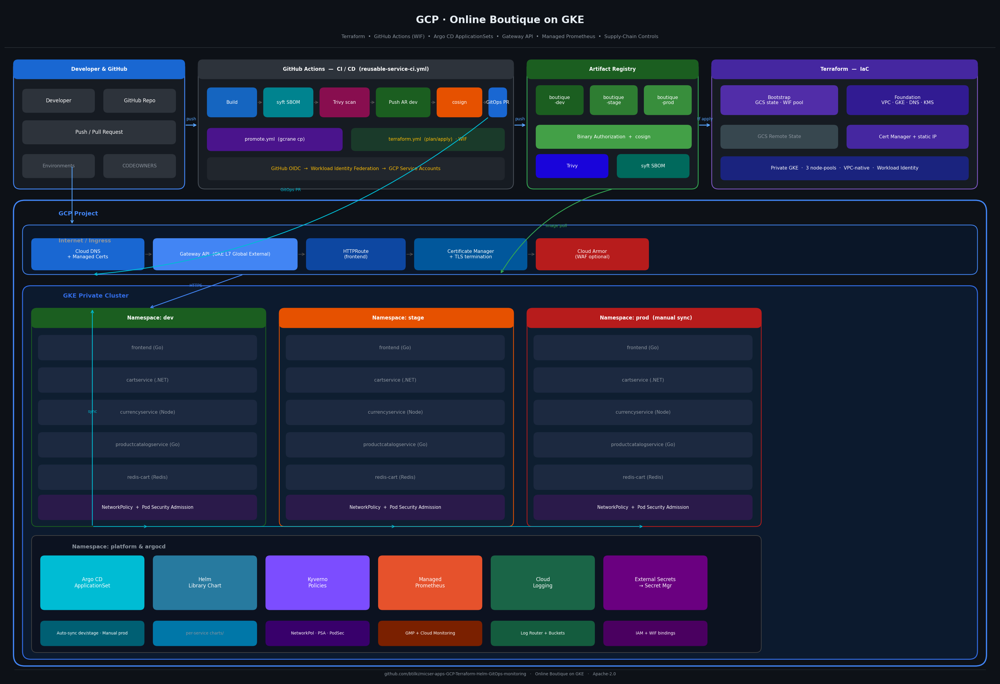
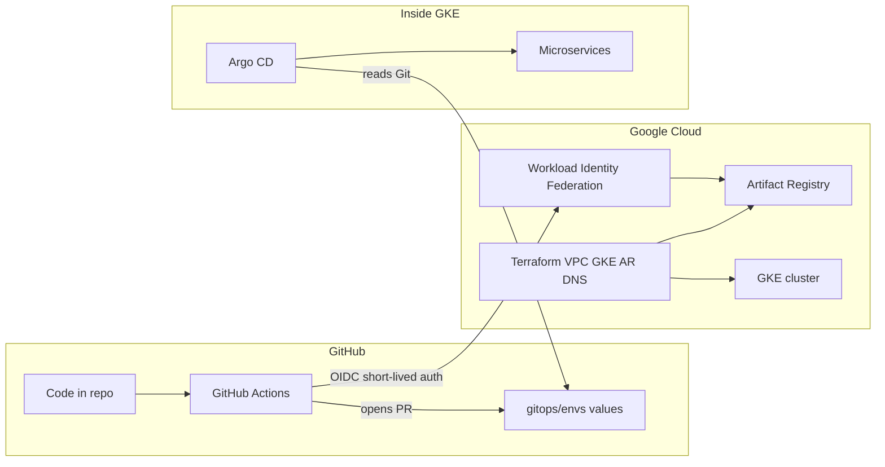

# Implementation guide

Follow these phases **in order** to deploy the platform yourself. Each phase has a checklist at the end.

| Phase | Doc | What you do |
|-------|-----|-------------|
| 0 | [phase-00-scaffold.md](phase-00-scaffold.md) | Repo already scaffolded — read what exists |
| 1 | [phase-01-gcp-and-terraform.md](phase-01-gcp-and-terraform.md) | GCP project, APIs, Terraform bootstrap + foundation |
| 2 | [phase-02-github-setup.md](phase-02-github-setup.md) | Create repo, push code, replace placeholders, secrets |
| 3 | [phase-03-github-actions.md](phase-03-github-actions.md) | Wire Actions to GCP; run first CI and Terraform workflows |
| 4 | [phase-04-argocd-and-platform.md](phase-04-argocd-and-platform.md) | Install Argo CD; sync Gateway, policies, workloads |
| 5 | [phase-05-first-service.md](phase-05-first-service.md) | Deploy `frontend` to `dev`; smoke test |
| 6 | [phase-06-promotion.md](phase-06-promotion.md) | Promote images dev → stage → prod |
| 7 | [phase-07-teardown.md](phase-07-teardown.md) | Tear down workloads, cluster, and GCP resources |

**Teardown (quick):** [../cost/teardown.md](../cost/teardown.md) — links to Phase 7 for full steps.



---

## How GitHub, GitHub Actions, and GCP work together



| System | Role |
|--------|------|
| **GCP** | Hosts GKE, Artifact Registry, DNS, IAM. Terraform creates infrastructure. |
| **GitHub** | Source of truth for application code and GitOps manifests. |
| **GitHub Actions** | Builds and scans images, pushes to Artifact Registry, opens PRs to update digests. **Does not** `kubectl apply` workloads — Argo CD does. |

**Auth model:** GitHub Actions uses **OIDC → Workload Identity Federation** (created in Phase 1). No long-lived GCP JSON keys in GitHub.

---

## Master checklist

Copy this into your notes and tick off as you go.

```text
Phase 1 — GCP
  □ GCP project created, billing linked
  □ gcloud + terraform + kubectl + helm installed locally
  □ APIs enabled
  □ bootstrap terraform apply
  □ Google Cloud Storage (GCS) backend configured, state migrated
  □ foundation terraform apply
  □ kubectl get nodes works
  □ Cloud DNS zone created (foundation apply)
  □ Registrar NS records point to Cloud DNS (e.g. boutique.example.com)

Phase 2 — GitHub
  □ Repository created and code pushed
  □ ORG / PROJECT_ID / REGION placeholders replaced
  □ Environments: build, terraform, prod
  □ Variables: GCP_PROJECT_ID, GCP_REGION
  □ Secrets: GCP_WIF_PROVIDER, GCP_TERRAFORM_SA, GCP_BUILD_SA, GCP_PROMOTE_SA
  □ Branch protection on main (recommended)

Phase 3 — GitHub Actions
  □ Terraform workflow plan succeeds
  □ CI frontend workflow builds and opens GitOps PR
  □ GitOps PR merged

Phase 4 — Argo CD
  □ Argo CD installed
  □ https://argocd.boutique.example.com reachable (DNS + cert map + HTTPRoute)
  □ bootstrap manifests applied
  □ Applications healthy in Argo UI

Phase 5 — First service
  □ frontend pods Running in dev namespace
  □ HTTPS/smoke test passes (when DNS ready)

Phase 6 — Promotion
  □ Stage (dev → stage, in order): redis-cart → productcatalogservice → currencyservice → cartservice → frontend
  □ All *-stage apps Synced / Healthy; smoke.sh https://stage.boutique.example.com passes
  □ Prod (stage → prod, same order); manual Argo sync per *-prod app
  □ smoke.sh https://boutique.example.com passes when prod is live

Phase 7 — Teardown (when lab is finished)
  □ Workloads and Gateway resources removed from cluster
  □ foundation terraform destroy
  □ bootstrap terraform destroy (optional)
  □ Billing verified at zero
```

---

## Information to collect before Phase 1

| Item | Example | Used in |
|------|---------|---------|
| GCP project ID | `boutique-dev-123456` | Terraform, GitHub variables |
| Region | `europe-west1` | Terraform, AR, GKE |
| GitHub org/user | `YOUR_GITHUB_ORG` | bootstrap `github_org`, GitOps `repoURL` |
| Repo name | `Microservices-Google` | bootstrap `github_repo` |
| Google Cloud Storage (GCS) state bucket | `tfstate-boutique-unique-2026` | bootstrap backend (globally unique) |
| Domain (optional) | `boutique.example.com` | Cloud DNS zone, Gateway, app hosts (`argocd`, `dev`, `stage`, apex) |
| Your public IPv4 | from `curl -4 ifconfig.me` | GKE `master_authorized_networks` (add multiple `/32` if IP rotates) |
