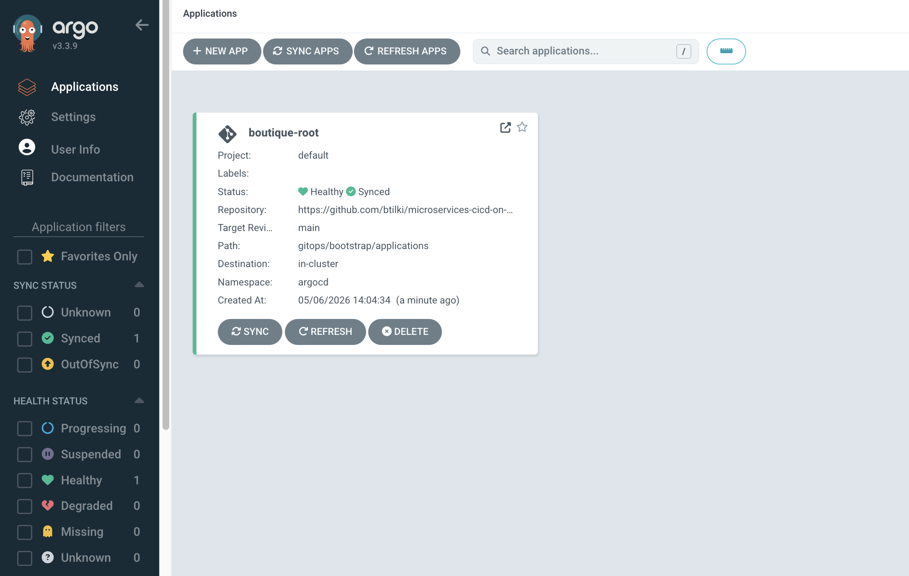

# Phase 4 — Argo CD and platform

Install Argo CD and sync platform resources (namespaces, Gateway, NetworkPolicies) and workloads (ApplicationSet).

**Previous:** [phase-03-github-actions.md](phase-03-github-actions.md)  
**Next:** [phase-05-first-service.md](phase-05-first-service.md)

---

## 4.1 Prerequisites

- Phase 1: GKE running, `kubectl get nodes` works
- Phase 2: `ORG` / `PROJECT_ID` / `REGION` replaced in GitOps manifests
- Phase 3: At least one GitOps values file merged (recommended: `frontend` dev digest)

If `kubectl` fails with `dial tcp …:443: i/o timeout`, your public IP is not in GKE `master_authorized_networks`. Check with `curl -4 ifconfig.me`, add the `/32` to `infra/terraform/envs/foundation/terraform.tfvars`, run `terraform apply`, then `make kubeconfig` (see [phase-01 §Common issues](phase-01-gcp-and-terraform.md#common-issues)).

---

## 4.2 Install Argo CD (one time)

Use **server-side apply** — the ApplicationSet CRD is too large for client-side `kubectl apply` (256 KiB annotation limit on recent Argo CD releases).

```bash
kubectl create namespace argocd

kubectl apply -n argocd --server-side --force-conflicts -f \
  https://raw.githubusercontent.com/argoproj/argo-cd/stable/manifests/install.yaml

kubectl wait --for=condition=available deployment/argocd-server -n argocd --timeout=300s
```

If you already ran plain `kubectl apply` and hit `applicationsets.argoproj.io … metadata.annotations: Too long`, re-run the same command above with `--server-side --force-conflicts`; the rest of the install is usually already in place.

Private GKE nodes need **Cloud NAT** to pull images from public registries (e.g. `quay.io` for Argo CD). NAT is defined in `infra/terraform/modules/network/` — run `terraform apply` in `envs/foundation` if pods show `ImagePullBackOff` with dial/timeouts to external hosts.

Get initial admin password:

```bash
kubectl -n argocd get secret argocd-initial-admin-secret \
  -o jsonpath="{.data.password}" | base64 -d && echo
```

Port-forward UI (local fallback only):

```bash
kubectl port-forward svc/argocd-server -n argocd 8080:443
# https://localhost:8080  user: admin
```

For day-to-day use, expose the UI at **https://argocd.boutique.example.com** — see [§4.3](#43-expose-argo-cd-ui-at-httpsargocdboutiqueexamplecom).

---

## 4.3 Expose Argo CD UI at https://argocd.boutique.example.com

The platform Gateway (`gitops/platform/gateway.yaml`) terminates HTTPS for `*.boutique.example.com` using Certificate Manager cert map `boutique-cert-map`. Add an HTTPRoute so `argocd.boutique.example.com` reaches the Argo CD server.

### 4.3.1 Prerequisites

- `boutique-platform` synced (Gateway exists in `platform` namespace)
- Cloud DNS zone delegated ([phase-01 §1.7](phase-01-gcp-and-terraform.md#17-create-the-cloud-dns-zone-and-delegate-your-domain))
- **Certificate Manager cert map** named exactly `boutique-cert-map` (same string in three places):

| Where | Value |
|-------|--------|
| GCP Certificate Manager → **Certificate maps** → map **name** | `boutique-cert-map` |
| Gateway annotation `networking.gke.io/certmap` in [gitops/platform/gateway.yaml](../../gitops/platform/gateway.yaml) | `boutique-cert-map` |
| Terraform variable `cert_map_name` (default in foundation) | `boutique-cert-map` |

The annotation uses the map **short name only** — not the full path `projects/…/certificateMaps/…`.

**Cert map entries** (hostname → certificate) must cover hosts the Gateway serves:

| Map entry hostname | Covers |
|--------------------|--------|
| `*.boutique.example.com` | `argocd`, `dev`, `stage`, … subdomains |
| `boutique.example.com` | apex (prod) |

That matches the Gateway listener `hostname: "*.boutique.example.com"` plus apex routes.

#### Option A — Terraform (recommended)

Foundation Terraform creates the DNS authorization record, managed wildcard cert, cert map, and entries automatically:

```bash
cd infra/terraform/envs/foundation
terraform apply   # creates module.certificate_manager.*
terraform output cert_map_name   # should print: boutique-cert-map
```

Provisioning the Google-managed certificate can take **15–60 minutes** after apply. Check status:

```bash
gcloud certificate-manager certificates list --project=YOUR_PROJECT_ID
```

#### Option B — Console (manual)

If you created resources in the Console with different names (e.g. `cert-map-1`), either **rename/recreate** to `boutique-cert-map` or change [gitops/platform/gateway.yaml](../../gitops/platform/gateway.yaml) and `cert_map_name` in Terraform to match what you created — all three must stay identical.

1. **Certificate Manager → DNS authorizations** — domain `boutique.example.com`; add the CNAME to Cloud DNS.
2. **Certificates** — Google-managed cert with domains `*.boutique.example.com` and `boutique.example.com`.
3. **Certificate maps → Create** — name **`boutique-cert-map`** (exact).
4. **Add entry** — hostname `*.boutique.example.com` → your certificate; repeat for `boutique.example.com`.

### 4.3.2 DNS A record

In the Cloud DNS managed zone for `boutique.example.com`, create:

| Name | Type | TTL | Data |
|------|------|-----|------|
| `argocd` | A | 300 | `terraform output -raw gateway_ip` |

CLI example:

```bash
GW_IP="$(terraform -chdir=infra/terraform/envs/foundation output -raw gateway_ip)"
gcloud dns record-sets create argocd.boutique.example.com. \
  --zone=boutique-example-com \
  --type=A --ttl=300 \
  --rrdatas="$GW_IP" \
  --project=YOUR_PROJECT_ID
```

Replace zone name and project if yours differ.

### 4.3.3 Terminate TLS at the Gateway

Patch Argo CD so the server speaks HTTP behind the Gateway (TLS ends at the load balancer):

```bash
kubectl patch configmap argocd-cmd-params-cm -n argocd --type merge \
  -p '{"data":{"server.insecure":"true"}}'
kubectl rollout restart deployment argocd-server -n argocd
kubectl rollout status deployment argocd-server -n argocd --timeout=120s
```

### 4.3.4 HTTPRoute + cross-namespace access

Save and apply from repo root (see [platform/manifests/argocd-httproute.yaml](../../platform/manifests/argocd-httproute.yaml)):

```bash
kubectl apply -f platform/manifests/argocd-httproute.yaml
kubectl get httproute -n argocd
kubectl describe httproute argocd-server -n argocd
```

Wait until the Gateway assigns the route (1–5 minutes), then open **https://argocd.boutique.example.com** (user `admin`, password from §4.2).

### 4.3.5 Verify

```bash
curl -sI https://argocd.boutique.example.com | head -5
```

Expect `HTTP/2 200` or `302` once DNS and the cert map have propagated.

---

## 4.4 Register repository (private repos only)

If the repo is **public**, skip this step.

For **private** repos, add a read-only deploy key or connect GitHub via Argo CD UI (**Settings → Repositories**).

---

## 4.5 Apply GitOps bootstrap

From repo root (manifests must already have correct `repoURL`):

```bash
kubectl apply -f gitops/bootstrap/project.yaml
kubectl apply -f gitops/bootstrap/root-app.yaml
```

The root app syncs child applications under `gitops/bootstrap/applications/`:

| Application | Syncs |
|-------------|-------|
| `boutique-platform` | `gitops/platform/` — namespaces, Gateway, NetworkPolicies |
| `boutique-workloads` | `gitops/applicationsets/` — service ApplicationSet |
| `boutique-kyverno-policies` | `policies/kyverno/` |

---

## 4.6 Verify platform

```bash
kubectl get applications -n argocd
kubectl get applicationsets -n argocd
kubectl get gateway -n platform
kubectl get namespaces | grep -E 'dev|stage|prod|platform'
```

In Argo CD UI at **https://argocd.boutique.example.com**, confirm apps are **Synced** / **Healthy** (may take a few minutes).



**Argo CD — `boutique-root` application Synced / Healthy**

**Gateway external IP:** should match Terraform `gateway_ip`. App DNS A records (`argocd`, `dev`, `stage`, `@`) should all point to that IP.

---

## 4.7 Kyverno (if not yet installed)

Cluster policies in `policies/kyverno/` require the **Kyverno admission controller**. Options:

1. Install Kyverno via Helm (see [platform/helm/README.md](../../platform/helm/README.md)), then let Argo sync policies.
2. Or apply policies manually after Kyverno is running:

```bash
kubectl apply -f policies/kyverno/   # after replacing REGION and PROJECT_ID
```

Policies apply only to **`dev`**, **`stage`**, and **`prod`** — not `argocd`, `kyverno`, `kube-system`, or `platform`.

Until Kyverno is installed, policy Applications may show **OutOfSync** — expected.

---

## 4.8 Prod sync behavior

**Prod** apps use `boutique-services-prod` (no auto-sync). In Argo UI, prod applications require **manual Sync** after promotion (Phase 6).

---

## Phase 4 checklist

```text
□ Argo CD server running
□ HTTPS UI at https://argocd.boutique.example.com (DNS + HTTPRoute + cert map)
□ gitops/bootstrap/project.yaml applied
□ gitops/bootstrap/root-app.yaml applied
□ boutique-platform application synced
□ boutique-workloads ApplicationSet created
□ Gateway resource exists in platform namespace
□ dev / stage / prod namespaces exist
```

---

## Common issues

| Problem | Fix |
|---------|-----|
| `kubectl` connection timeout | `curl -4 ifconfig.me` → add `/32` to `master_authorized_networks`, `terraform apply`, `make kubeconfig` |
| `https://argocd.boutique.example.com` unreachable | Check A record → `gateway_ip`; cert map **name** is exactly `boutique-cert-map` (matches Gateway annotation); HTTPRoute `Accepted` |
| Cert map / Gateway name mismatch | `kubectl get gateway boutique-gateway -n platform -o yaml \| grep certmap` must equal GCP map name; fix with Terraform or rename map |
| Argo CD UI loads but cert warning | Wait for Certificate Manager provisioning (`gcloud certificate-manager certificates list`); confirm map entries for `*.boutique.example.com` and `boutique.example.com` |
| Application **Unknown** revision | Wrong `repoURL` or private repo not registered |
| ImagePullBackOff | Image not in AR yet — run CI (Phase 3) |
| Gateway no address | GKE Gateway controller may need a few minutes; check GKE Gateway add-on |
| Kyverno rejects pods | Ensure digest in values file matches `image@sha256:...` pattern |
