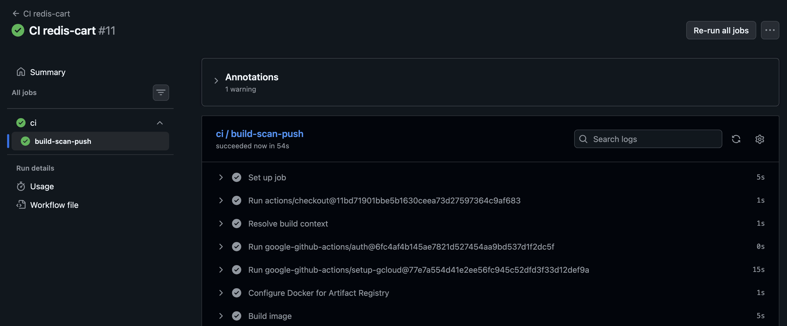
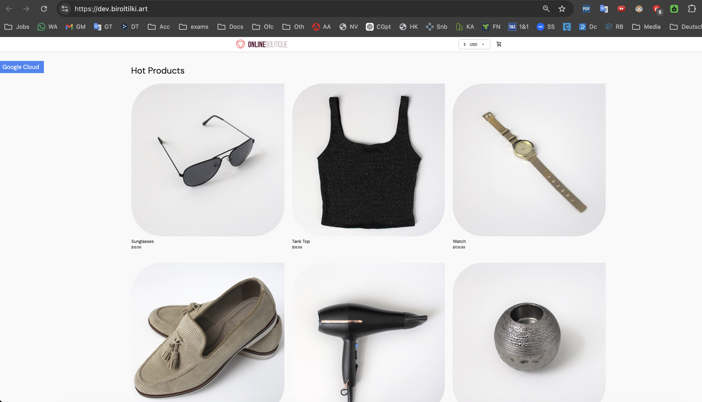
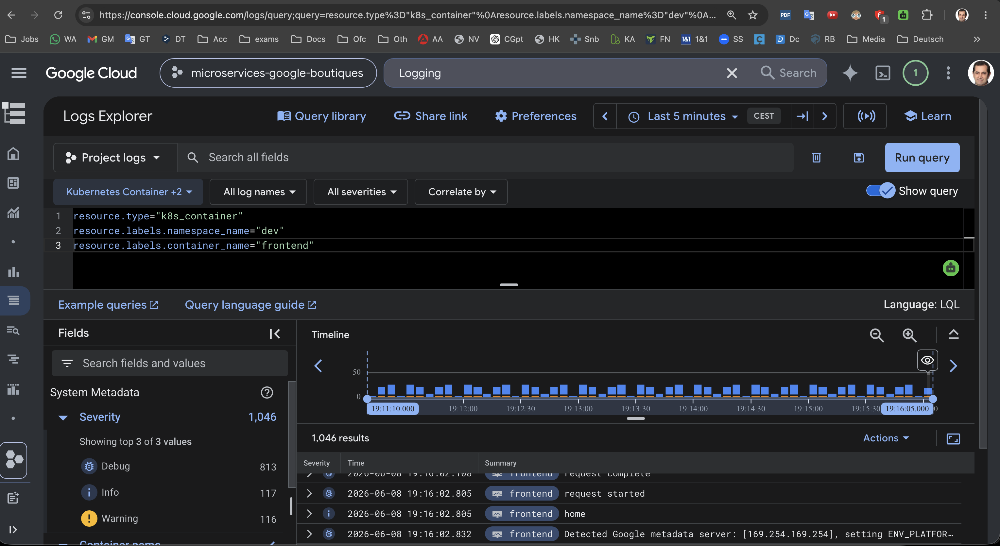

# Phase 5 — First service deployment

Deploy `frontend` (and dependencies) to the `dev` namespace and verify end-to-end.

**Previous:** [phase-04-argocd-and-platform.md](phase-04-argocd-and-platform.md)  
**Next:** [phase-06-promotion.md](phase-06-promotion.md)

---

## 5.1 Deploy order in dev

The boutique app needs backing services. Sync or ensure these run in `dev` **before** frontend serves traffic:

1. `redis-cart-dev`
2. `productcatalogservice-dev`
3. `currencyservice-dev`
4. `cartservice-dev`
5. `frontend-dev`

In Argo CD you can sync all `*-dev` apps, or rely on ApplicationSet auto-sync for dev.

The same order applies when promoting to **stage** or **prod** — see [phase-06 §6.2](phase-06-promotion.md#62-promote-to-stage).

---

## 5.2 Build and GitOps all dev services

For each service, run its CI workflow (or push under `apps/<service>/`):

- CI frontend
- CI cartservice
- CI currencyservice
- CI productcatalogservice
- CI redis-cart

Merge each GitOps PR updating `gitops/envs/dev/values-*.yaml`.



**CI redis-cart — build-scan-push job succeeded**

---

## 5.3 Verify pods

```bash
kubectl get pods -n dev
kubectl get svc -n dev
kubectl get httproute -n dev
```

All owned workloads should be `Running`. Check logs if not:

```bash
kubectl logs -n dev deploy/frontend --tail=50
```

In Argo CD, confirm all `*-dev` applications are **Synced** / **Healthy** (frontend last):


**Argo CD — `*-dev` applications Synced / Healthy**

---

## 5.4 DNS and HTTPS

When DNS A record for `dev.boutique.example.com` points to `gateway_ip`:

```bash
bash scripts/smoke.sh https://dev.boutique.example.com
```



**Dev storefront — https://dev.boutique.example.com**

Without DNS, port-forward for a quick check:

```bash
kubectl port-forward -n dev svc/frontend 8080:80
curl -s -o /dev/null -w "%{http_code}" http://localhost:8080
```

---

## 5.5 Cloud Logging

In Cloud Console → **Logging → Log Explorer**:

```text
resource.type="k8s_container"
resource.labels.namespace_name="dev"
resource.labels.container_name="frontend"
```

Save the query for later triage.



**Cloud Logging — frontend container logs in the dev namespace**

---

## 5.6 Stage (Phase 6)

Dev proves the stack; **stage** is deployed in [phase-06 §6.2](phase-06-promotion.md#62-promote-to-stage) using the **same service order** (backing services first, frontend last). Do not smoke-test `https://stage.boutique.example.com` until all five `*-stage` Argo apps are Synced / Healthy.

```bash
kubectl get pods -n stage
kubectl get applications -n argocd | grep stage
bash scripts/smoke.sh https://stage.boutique.example.com
```

---

## Phase 5 checklist

```text
□ All five *-dev Argo applications synced
□ Pods Running in dev namespace
□ frontend HTTPRoute attached to boutique-gateway
□ smoke.sh succeeds (or port-forward returns 200)
□ Sample log query saved in Cloud Logging
```
