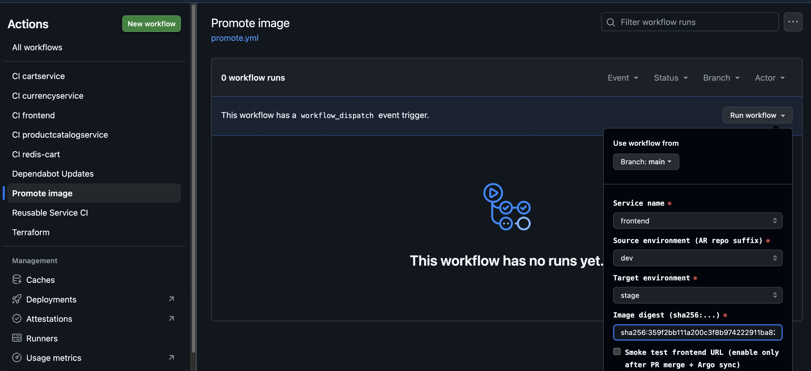
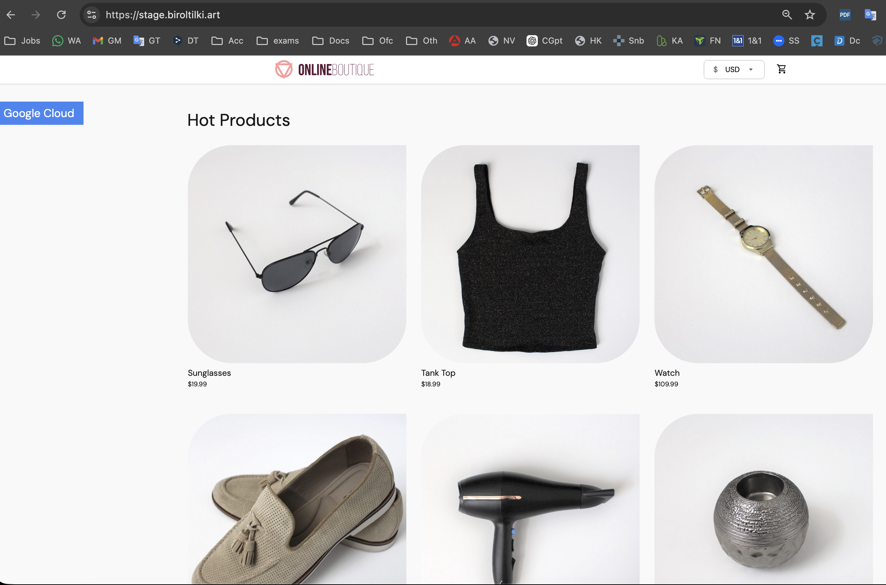
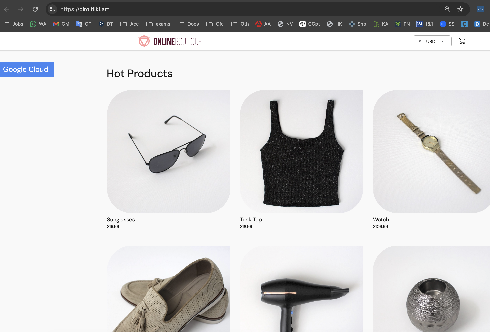

# Phase 6 — Promotion (dev → stage → prod)

Promote immutable images by digest across Artifact Registry repos and GitOps environments.

**Previous:** [phase-05-first-service.md](phase-05-first-service.md)  
**Next:** [phase-07-teardown.md](phase-07-teardown.md)

---

## 6.1 Promotion model

```text
CI builds once  →  boutique-dev AR
promote.yml     →  gcrane cp (by digest; registry-to-registry copy)
GitOps PR       →  updates gitops/envs/<target>/values-<service>.yaml
Argo CD         →  syncs target namespace
```

- **No rebuild** on promote — same digest, different AR repo.
- **stage:** auto-sync after PR merge.
- **prod:** manual Argo Sync + GitHub `prod` environment approval on promote workflow.

---

## 6.2 Promote to stage

Stage needs the same deploy order as dev (see [phase-05 §5.1](phase-05-first-service.md#51-deploy-order-in-dev)). **Promote and merge backing services before frontend**, or the storefront returns HTTP 500/503 when gRPC upstreams are missing.

| Order | Service | Dev digest source |
|-------|---------|-------------------|
| 1 | `redis-cart` | `gitops/envs/dev/values-redis-cart.yaml` |
| 2 | `productcatalogservice` | `gitops/envs/dev/values-productcatalogservice.yaml` |
| 3 | `currencyservice` | `gitops/envs/dev/values-currencyservice.yaml` |
| 4 | `cartservice` | `gitops/envs/dev/values-cartservice.yaml` |
| 5 | `frontend` | `gitops/envs/dev/values-frontend.yaml` |

For each service:

1. Note the digest from the dev values file (e.g. `sha256:abc123...`).
2. **Actions** → **Promote image** → Run workflow:
   - `service`: (from table above)
   - `source_env`: `dev`
   - `target_env`: `stage`
   - `digest`: `sha256:...`
   - `run_smoke_test`: `false` (leave off until all five services are synced)

   

   **Promote image workflow — dev → stage (digest, smoke test off)**

3. Merge the promotion PR.
4. Argo auto-syncs `*-stage` apps. Verify pods:

```bash
kubectl get pods -n stage
kubectl get applications -n argocd | grep stage
```


**Argo CD — dev and stage service applications after promotion**

5. After **all five** `*-stage` apps are Synced / Healthy, smoke test:

```bash
bash scripts/smoke.sh https://stage.boutique.example.com
```



**Stage storefront — https://stage.boutique.example.com**

Stage values must include the same `containerSecurityContext` / `envVars` overrides as dev (e.g. `runAsUser` for distroless and redis, `envVars` for frontend upstreams). Without them, pods fail with `CreateContainerConfigError` or the app cannot reach backends.

---

## 6.3 Promote to prod

Prod uses the **same deploy order** as dev and stage. Promote **backing services before frontend**, or the storefront returns HTTP 500/503 when gRPC upstreams are missing.

| Order | Service | Digest source (after stage is healthy) |
|-------|---------|------------------------------------------|
| 1 | `redis-cart` | `gitops/envs/stage/values-redis-cart.yaml` |
| 2 | `productcatalogservice` | `gitops/envs/stage/values-productcatalogservice.yaml` |
| 3 | `currencyservice` | `gitops/envs/stage/values-currencyservice.yaml` |
| 4 | `cartservice` | `gitops/envs/stage/values-cartservice.yaml` |
| 5 | `frontend` | `gitops/envs/stage/values-frontend.yaml` |

For each service:

1. Note the digest from the stage values file.
2. **Actions** → **Promote image** → Run workflow:
   - `service`: (from table above)
   - `source_env`: `stage`
   - `target_env`: `prod`
   - `digest`: `sha256:...`
   - `run_smoke_test`: `false` until all five `*-prod` apps are manually synced
3. Merge the promotion PR.
4. **Manual Argo Sync** for each `*-prod` app (prod does not auto-sync). Verify:

```bash
kubectl get pods -n prod
kubectl get applications -n argocd | grep prod
```

5. After all five `*-prod` apps are Synced / Healthy:

```bash
bash scripts/smoke.sh https://boutique.example.com
```



**Prod storefront — https://boutique.example.com**

**Before first prod deploy:**

- Binary Authorization is configured to require attestations (see [SECURITY.md](../../SECURITY.md)).
- Ensure CI created attestations (`gcloud beta container binauthz attestations ...` step in reusable CI).
- Prod values need the same `containerSecurityContext` / `envVars` overrides as dev and stage.

---

## 6.4 Rollback

To roll back prod, either:

- Promote a known-good digest from stage to prod again, or
- Revert the GitOps PR and manual Sync in Argo.

Document known-good digests in your ops notes for rehearsed rollback.

---

## Phase 6 checklist

```text
□ Stage: redis-cart → productcatalogservice → currencyservice → cartservice → frontend (dev → stage)
□ All five *-stage Argo apps Synced / Healthy; smoke.sh https://stage.boutique.example.com passes
□ Prod: same order (stage → prod); PR merged; manual Argo sync per *-prod app
□ smoke.sh https://boutique.example.com passes when prod is live
□ Prod promotion required reviewer approval (if configured)
```

---

## Common issues

| Problem | Fix |
|---------|-----|
| Stage smoke test 503 / frontend HTTP 500 | Promote all backing services first; check `kubectl get pods -n stage` and frontend logs for `lookup currencyservice` DNS errors |
| Stage DNS timeout after pods Running | Ensure `allow-dns` and `allow-same-namespace` NetworkPolicies exist in `stage` (see `gitops/platform/networkpolicy-baseline.yaml`) |
| `gcrane cp` denied (403) | `sa-promote-ci` IAM on source (reader) and target (writer) repos |
| Prod pod blocked by Binary Authorization | Image needs attestation from CI; check attestor name `boutique-cosign` |
| Prod sync automatic when it shouldn't | Confirm app is from `boutique-services-prod` (no automated syncPolicy) |
